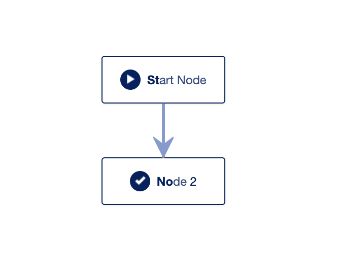
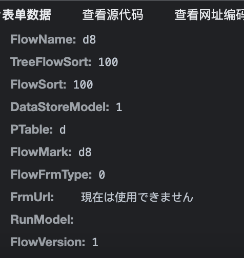
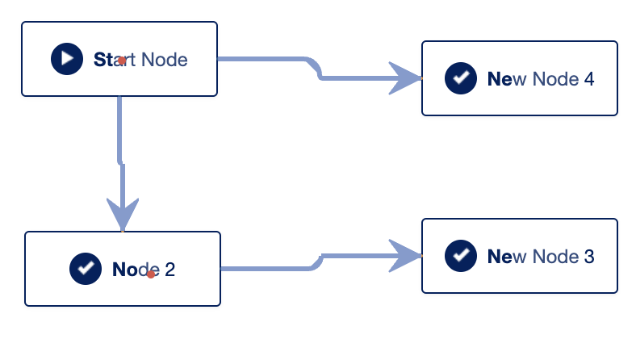
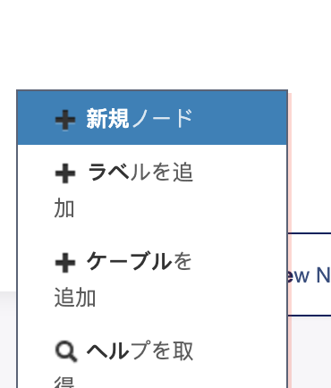
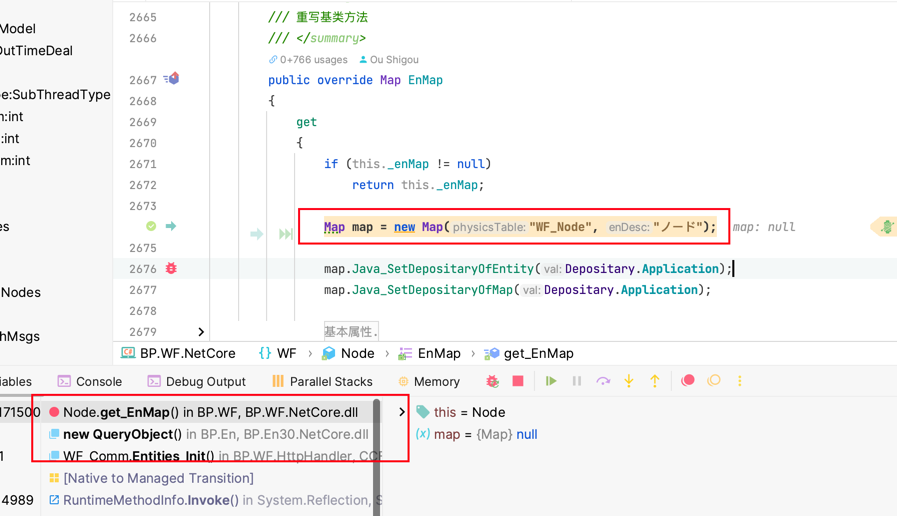

CCFlow API 原理及实现
===========================
`CCFlow`的核心API代码基本的讲解在官方文档中并未涉及，只做了核心表的 [简介](https://gitee.com/opencc/JFlow/wikis/%E5%AE%89%E8%A3%85&%E9%9B%86%E6%88%90/%E6%95%B0%E6%8D%AE%E7%BB%93%E6%9E%84%E8%A1%A8/%E6%B5%81%E7%A8%8B%E6%A8%A1%E6%9D%BF%E8%A1%A8)，这里写一篇文章，对`CCFlow`核心API进行相关梳理 
# 目录
- [创建Flow模板流程](#创建flow模板流程)
- [保存Flow时的操作](#保存Flow时的操作)
- [Create Node的具体实现](#CreateNode的具体实现)
## 创建Flow模板流程 
创建Flow模板流程的过程比较简单，新建的模板只有两个默认节点，如下图所示

### 新建Flow的流程如下
* 首先查询当前的Flow_Mark，`@FlowMark=d8` 是当前的Mark ID 用来校验是否已经存在当前Mark
```
Handler.ashx?DoType=Entities_Init&EnsName=BP.WF.Flows&Paras=@FlowMark=d8&t=1690421815756
```
* 第二步调用`Defualt_NewFlow`，传入下面的参数

  
并在执行下面的方法
```C#
public string Defualt_NewFlow()
    {
        // 获取请求参数并处理
        int runModel = this.GetRequestValInt("RunModel");
        ......
        
        // NewFlow 方法 生成模板方法
        string flowNo = BP.WF.Template.TemplateGlo.NewFlow(FlowSort, FlowName,
                Template.DataStoreModel.SpecTable, PTable, FlowMark, FlowVersion);

        Flow fl = new Flow(flowNo);

        //清空WF_Emp 的StartFlows ,让其重新计算.
        DBAccess.RunSQL("UPDATE  WF_Emp Set StartFlows =''");
        return flowNo;
    }
```
其中的.TemplateGlo.NewFlow()方法会具体的执行生成新flow的方法，主要涉及
生成Flow 写入数据库，并且在此步骤中，创建Flow的默认Node 和 Directions（方向箭头）
```C#
// 创建Flow 包含创建Node
string flowNo = fl.DoNewFlow(flowSort, flowName, dsm, ptable, flowMark);
fl.No = flowNo;
fl.Retrieve();


//如果为CCFlow模式则不进行写入Json串
if (flowVer == "0")
    return flowNo;

//创建连线
Direction drToNode = new Direction();
drToNode.FK_Flow = flowNo;
drToNode.Node = int.Parse(int.Parse(flowNo) + "01");
drToNode.ToNode = int.Parse(int.Parse(flowNo) + "02");
drToNode.Insert();

// @liuqiang  增加方向.
Node nd = new Node(drToNode.Node);
nd.HisToNDs = drToNode.ToNode.ToString();
nd.Update();
```
`DoNewFlow`方法期中的主要操作包括 删除可能已经存在的历史Flow 新增Node
```c#
1. 先删除有可能存在的历史数据 再写入数据库
Flow fl = new Flow(this.No);
// 删除
fl.DoDelData();
fl.DoDelete();
// 删除后在保存
this.Save();

2. 新增Node
Node nd = new Node();
nd.NodeID = int.Parse(this.No + "01");
nd.Name = "Start Node";//  "开始节点"; 
nd.Step = 1;
......
nd.X = 200;
nd.Y = 150;
nd.NodePosType = NodePosType.Start;
nd.ICON = "フロント";
```
## 保存Flow时的操作
假设此时我们的流程结构如下图所示


  
那么此时点击保存按钮，浏览器会调用 Designer_Save 方法
这时候的参数，其中Node代表所有的节点， Dirs代表方向
```
Nodes: @1801,198,120@1802,200,250@1803,446,242@1804,446,132
Dirs: @018_1801_1802,018,1801,1802@018_1801_1804,018,1801,1804@018_1802_1803,018,1802,1803
```
当在`Designer_Save()`保存新规的节点时，具体的流程如下，首先是处理Node
```c#
// 保存节点位置. 假设我们的 参数中
// Nodes为Nodes: @1801,198,120@1802,200,250@1803,446,242@1804,446,132
string[] nodes = this.GetRequestVal("Nodes").Split('@');
// 此时对数组进行循环 [(1801,198,120),(1802,200,250).......]
foreach (string item in nodes)
{
    if (item == "" || item == null)
        continue;
    string[] strs = item.Split(',');
    // 1802 200 250 分别代表 Node Id 和X Y 坐标 
    sBuilder.Append("UPDATE WF_Node SET X=" + strs[1] + ",Y=" + strs[2] + " WHERE NodeID=" + strs[0] + ";");
}
```
其次处理Directions(箭头连线)
```
// 假设此时的Dirs参数 
// @018_1801_1802,018,1801,1802@018_1801_1804,018,1801,1804@018_1802_1803,018,1802,1803
sBuilder = new StringBuilder();
string[] dirs = this.GetRequestVal("Dirs").Split('@');
foreach (string item in dirs)
{
    if (item == "" || item == null)
        continue;
    string[] strs = item.Split(',');
    // 删除旧的数据 避免出错
    sBuilder.Append("DELETE FROM WF_Direction where MyPK='" + strs[0] + "';");
    // 018_1801_1802: 主键, 018:FlowID, 1801:FromNode, 1802:ToNode 
    sBuilder.Append("INSERT INTO WF_Direction(MyPK,FK_Flow,Node,ToNode,IsCanBack) values ('" + strs[0] + "','" + strs[1] + "','" + strs[2] + "','" + strs[3] + "'," + "0);");
}
// 运行SQL
DBAccess.RunSQLs(sBuilder.ToString());
```
## CreateNode的具体实现
当我们使用右键新规Node时



会调用Create_Node()方法，并且传入Node的相关参数
```
X: 145
Y: 412
FK_Flow: 018
```
后台收到请求后，会调用Create_Node()
```
public string CreateNode()
{
    string x = this.GetRequestVal("X");
    string y = this.GetRequestVal("Y");
    .......
    // 生成Node
    int nodeId = BP.WF.Template.TemplateGlo.NewNode(this.FK_Flow, iX, iY,icon);
    .......
}
```
在`BP.WF.Template.TemplateGlo.NewNode()`中，程序会调用`DoNewNode()`进行实际的新规操作
```
 public Node DoNewNode(int x, int y, string icon = null)
        {
            // 进行一些赋值操作
            Node nd = new Node();
            int idx = this.HisNodes.Count;
            ......
            
            // 实际插入
            nd.FWCVer = 1;
            nd.Insert();
            nd.CreateMap();
        }
```
在`nd.Insert();`中会根据系统的配置执行不同的数据库的SQL操作
```
  switch (SystemConfig.AppCenterDBType)
    {
        case DBType.MSSQL:
            return this.RunSQL(this.SQLCash.Insert, SqlBuilder.GenerParas(this, null));
        case DBType.Access:
            return this.RunSQL(this.SQLCash.Insert, SqlBuilder.GenerParas(this, null));
            break;
        case DBType.MySQL:
        case DBType.Informix:
        default:
            return this.RunSQL(this.SQLCash.Insert.Replace("[", "").Replace("]", ""), SqlBuilder.GenerParas(this, null));
    }
```
`this.SQLCash.Insert`中物理逻辑的表名是`WF_NODE`，是在系统启动后，在渲染GUI页面时会进行自动的注入，如下图所示



并且写入数据库操作完成之后会刷新缓存
```
// 开始更新内存数据。 @wangyanyan
if (this.EnMap.DepositaryOfEntity == Depositary.Application)
    Cash2019.PutRow(this.ToString(), this.PKVal.ToString(), this.Row);

this.afterInsert();
this.afterInsertUpdateAction();
```
